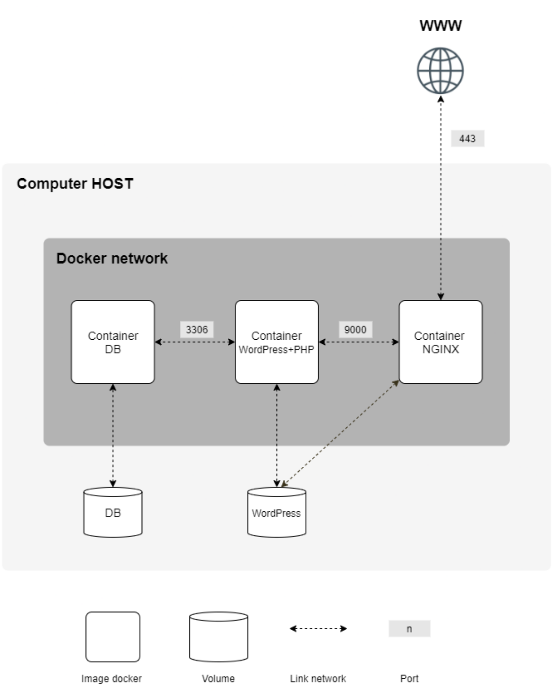
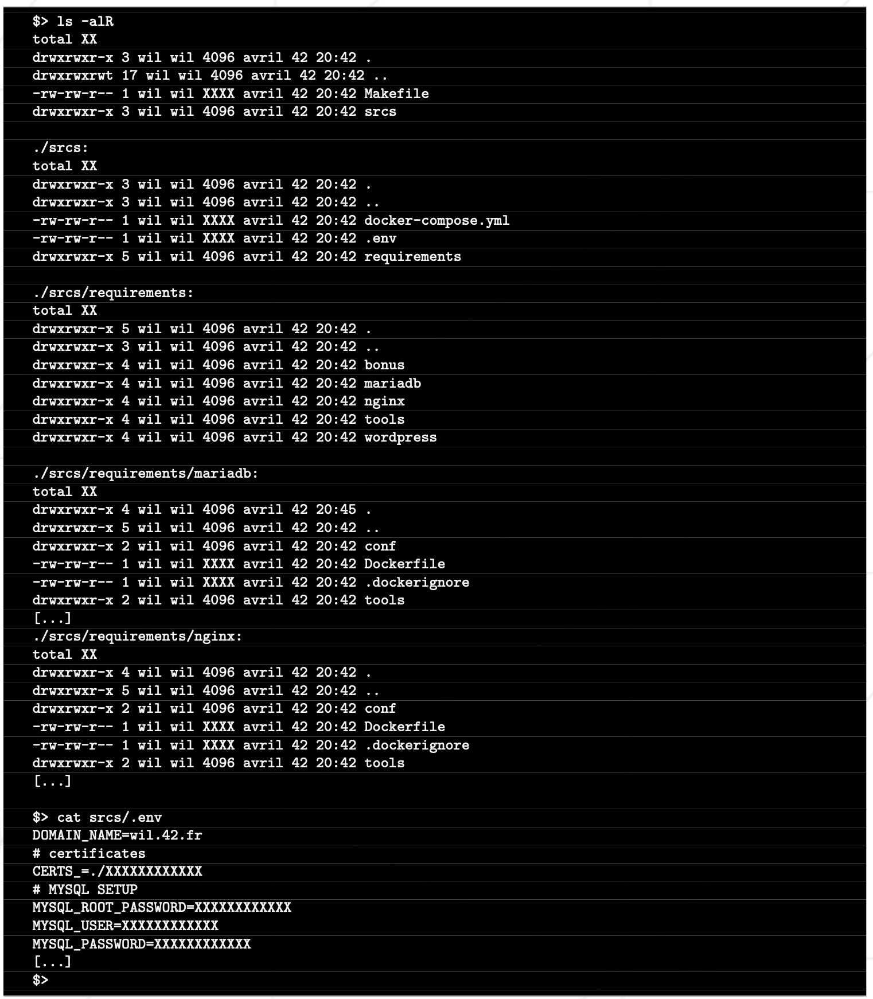

# Mandatory

## Guidelines
- The project need to be done on a Virtual Machine
- All configuration files must be placed in a ```srcs``` folder
- A makefile is required and must be present at the root of the project and it should be used to setup the entire application

## To-Do
- Each Docker image must have the same name as the service
- Each service has to run in a dedicated container
- The containers must be built from the penultimate stable version of either **Alpine** or **Debian**
- Each service must have a **Dockerfile** for his setup
- The **Dockerfiles** must be called from a docker-compose.yml file

<div align="center"><b>/!\ All images must be home-made, no images coming from DockerHub /!\</b></div>

## What to set-up :
* A Docker container containing **NGINX** with TLSv1.2 or TLSv1.3
* A Docker container containing **WordPress** and **php-fpm** (installed and configured) without NGINX
* A Docker container containing **MariaDB** without NGINX
* A volume containing the _WordPress database_
* A volume containing the _WordPress website files_
* A docker-network that establishes a connection between all the containers

## Some expected behaviors :
* In case of a crash, everything must restart properly
* Inside the WordPress database, there must be two users, one of them being the Admin.
* The domain name will point to the local IP address. Domain name muste be login.42.fr
* Usage of environment variables, the use of .env file is strongly recommended
* The NGINX container must be the only entrypoint into the infrastructure via port 443 only

## Examples

|  | 
|:--:| 
| *Diagram of the expected result* |

|  | 
|:--:| 
| *Example of expected directory structure* |

<p align="center">
- ## [**NEXT**](../docker/docker_base.md)
</p>
